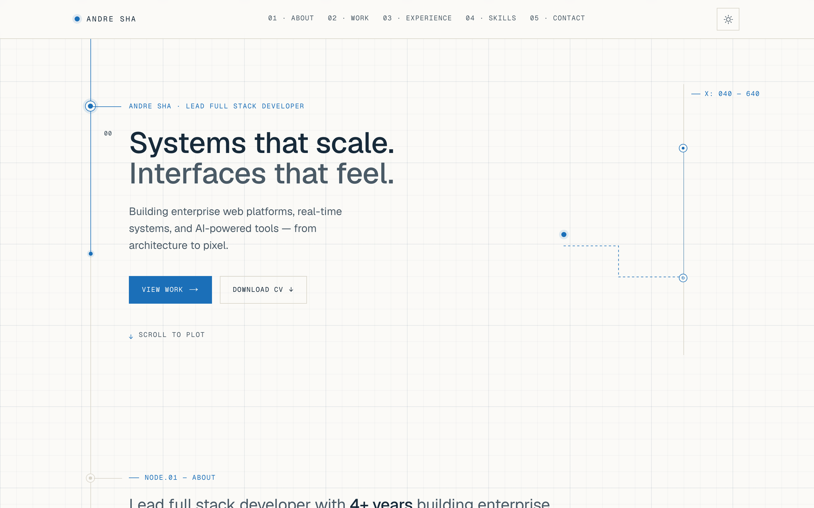

# Andre Sha — Portfolio

A fast, single-page developer portfolio with a blueprint aesthetic — thin construction lines, monospace coordinate annotations, and SVG circuit paths that draw themselves as you scroll.

**Live demo →** https://andresha.dev



## Features

- **Scroll-driven blueprint animation** — SVG circuit paths draw in sync with scroll position (anime.js `createDrawable` + scroll observer), with node markers and coordinate annotations revealing as the line reaches each section.
- **Theme system built on CSS variables** — light/dark switch by swapping custom-property values rather than duplicating class sets. The initial theme is resolved by an inline pre-paint script to avoid a flash of incorrect theme, with a persisted manual toggle that falls back to `prefers-color-scheme`.
- **Server-first component architecture** — React Server Components by default; client components only where interactivity demands it (theme toggle, scroll-draw wrapper).
- **SEO-complete** — Metadata API, Open Graph and Twitter cards, JSON-LD `Person` schema, a dynamic Open Graph image, plus generated `sitemap.ts` and `robots.ts`.
- **Accessibility-first** — semantic landmarks, skip-to-content link, visible focus rings, and a `prefers-reduced-motion` guard that disables the scroll animation and renders the final drawn state.
- **Content-driven sections** — projects, experience, and skills live in typed data files, so sections render from data rather than hardcoded markup.

## Tech stack

Next.js 16 (App Router) · React 19 · TypeScript · Tailwind CSS v4 · anime.js · lucide-react · Vercel Analytics · Biome

## Running locally

```bash
git clone https://github.com/shaandre96/portfolio-website.git
cd portfolio-website
npm install
npm run dev
```

The public site URL can be overridden at build time with the optional `NEXT_PUBLIC_SITE_URL` environment variable; it defaults to `https://andresha.dev`.

## Notes

Built as a personal portfolio that doubles as a working demonstration of the blueprint design language and a server-first Next.js 16 architecture. The scroll-draw interaction is the signature piece, and the entire theme is driven by CSS variables mapped into Tailwind via `@theme`.
